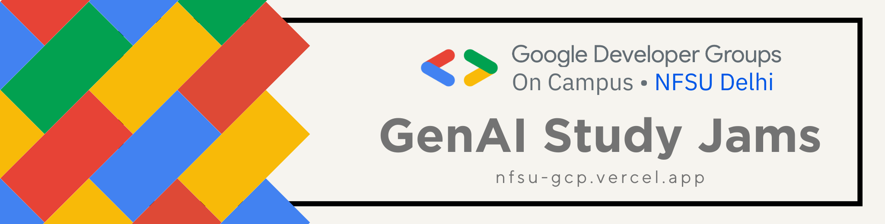

# GCP-Progress

# Google Developers Group on Campus - National Forensic Sciences University

This is the official GitHub Organization of GDG on Campus-NFSU. \
GDSCs are a university-based community group for students interested in Google developer technologies. Students from all UG or PG programs with an interest in growing as a developer are welcome. By joining a GDG on Campus, students grow their knowledge in a p2p learning environment and build solutions.

## Connect with us!

